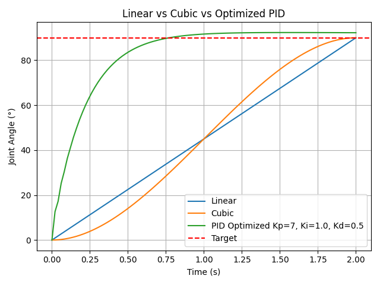

# Single-Joint Motion Simulation & PID Optimization

## Project Description
This project simulates the motion of a single robotic joint from **0° → 90°** using **Linear, Cubic, and PID control**.  
Experiments include **parameter sweeps, PID tuning, and automated optimization** to identify the **optimal PID gains** for fastest, most accurate motion.

---

## Experiments Overview

1. **Experiment 1 - Linear vs. Cubic Motion**  
   Compare motion trajectories and analyze smoothness and speed.

2. **Experiment 2 - Parameter Sweep: Total Time & Steps**  
   Test different total times and number of steps to measure performance metrics.

3. **Experiment 3 - PID Control of a Single Joint**  
   Implement basic PID control and manually tune gains.

4. **Experiment 4 - Optimal PID Tuning**  
   Automatically find the best combination of **Kp, Ki, Kd** for minimal overshoot, fastest settling, and near-zero final error.

5. **Experiment 5 - Comparison of Motion Methods**  
   Compare Linear, Cubic, and Optimized PID trajectories in a single plot.

---

## Skills Demonstrated

- **Python**: NumPy, Matplotlib, CSV handling  
- **Control Systems**: PID implementation and tuning  
- **Data Collection & Analysis**: Metrics calculation, visualization  
- **Research-Style Optimization**: Automated parameter search for PID gains  
- **Project Organization**: Clean folder structure for reproducibility  

---

## Results

### Key Metrics
| Method | Overshoot (°) | Settling Time (s) | Final Error (°) |
|--------|---------------|-----------------|----------------|
| Linear | X.X           | X.X             | X.X            |
| Cubic  | X.X           | X.X             | X.X            |
| PID (Optimized) | X.X    | X.X             | X.X            |

> ✅ Optimized PID gains: **Kp=7, Ki=1.0, Kd=0.5**

### Comparison Plot

- The red dashed line represents the **target joint angle (90°)**  
- PID control reaches the target fastest with minimal overshoot and final error  

